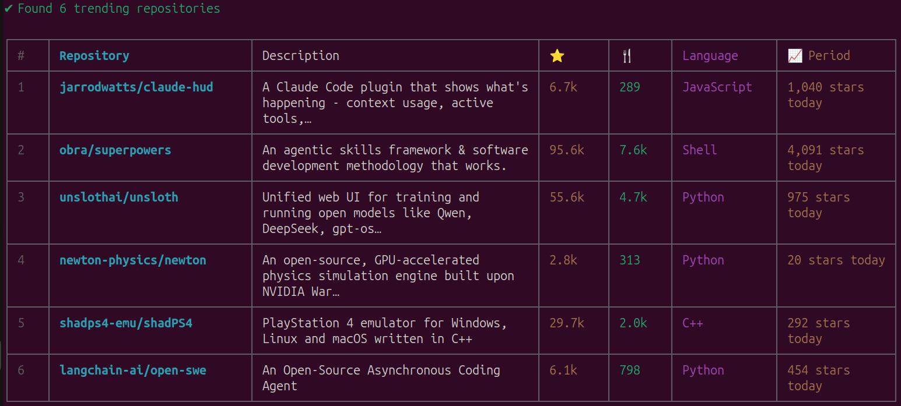

# ghnow

> Browse GitHub trending repositories and developers from your terminal. View READMEs, export data, and skip the web interface entirely.

[](LICENSE)
[](https://nodejs.org)
[](package.json)

<p align="center">
  
</p>

---

## Features

- 🔥 **Trending repos** — browse today's / this week's / this month's hottest repositories
- 👩‍💻 **Trending developers** — see who's trending on GitHub right now
- 📖 **README viewer** — read any repo's README directly in your terminal
- 💾 **Export** — save results as JSON, CSV, or Markdown; save READMEs as `.md` files
- 🔎 **Filters** — by programming language, spoken language, and time range
- 📊 **Multiple formats** — rich table, compact list, or raw JSON (pipe to `jq`)
- 🔐 **GitHub token** — optional `GITHUB_TOKEN` for higher API rate limits

## Install

```bash
git clone https://github.com/smarkstrife/ghnow.git
cd ghnow
npm install
npm link
```

**Requires Node.js 18+** (uses native `fetch`).

## Quick Start

```bash
ghnow                           # today's trending repos
ghnow repos -l python -s weekly # Python repos, weekly
ghnow devs                      # trending developers
ghnow readme facebook/react     # view README in terminal
```

## Commands

### `ghnow repos` — Trending Repositories

> This is the **default command** — `ghnow` with no arguments does the same thing.

```bash
ghnow repos                        # today's trending, table format
ghnow repos -l rust                # filter by language
ghnow repos -s weekly              # weekly trending
ghnow repos -s monthly             # monthly trending
ghnow repos --spoken en            # filter by spoken language
ghnow repos -n 10                  # limit to top 10
ghnow repos -f list                # compact one-line format
ghnow repos -f json                # JSON (great with jq)
ghnow repos -f json | jq '.[].name' # extract just repo names via jq
ghnow repos --export trending.json # export to file
ghnow repos --export trending.csv
ghnow repos --export trending.md
```

| Option | Short | Description | Default |
|--------|-------|-------------|---------|
| `--language <lang>` | `-l` | Programming language filter | All |
| `--since <period>` | `-s` | `daily`, `weekly`, or `monthly` | `daily` |
| `--spoken <code>` | | Spoken language code (e.g. `en`, `zh`) | All |
| `--format <type>` | `-f` | `table`, `list`, or `json` | `table` |
| `--limit <count>` | `-n` | Max results | All |
| `--export <file>` | `-e` | Export to `.json`, `.csv`, or `.md` | — |

### `ghnow devs` — Trending Developers

```bash
ghnow devs                         # today's trending devs
ghnow devs -l javascript -s weekly # JS devs, weekly
ghnow devs -f json                 # JSON output
ghnow devs --export devs.csv       # export
```

Same options as `repos` (except `--spoken`).

### `ghnow readme <owner/repo>` — View README

Renders a repository's README with full Markdown formatting in your terminal.

```bash
ghnow readme torvalds/linux
ghnow readme facebook/react
ghnow readme sxyazi/yazi --export yazi.md   # save as .md file
```

> 💡 Every time you view a README in terminal, a tip reminds you that you can export it as a markdown file for viewing in VS Code, Obsidian, etc.

| Option | Short | Description |
|--------|-------|-------------|
| `--export <file>` | `-e` | Save raw markdown to file instead of displaying |

## GitHub Token

The `readme` command uses the GitHub API (60 req/hr unauthenticated). For higher limits:

```bash
export GITHUB_TOKEN=ghp_your_token_here   # 5,000 req/hr
ghnow readme torvalds/linux
```

## How It Works

`ghnow` scrapes the public [github.com/trending](https://github.com/trending) page — GitHub doesn't provide an official trending API. Results are cached for 5 minutes to avoid redundant requests.

## Author

**Shikhar Srivastava**

## License

[MIT](LICENSE)
